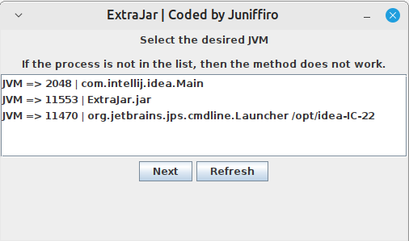

#  ExtraJar: Java agents loader

**ExtraJar** is a simple GUI application for loading Java agents into a running JVM.
# 

## Open source

ExtraJar is an open source project distributed under the Apache License 2.0 <br>

## Getting started

1. Download the latest build from releases
2. Open the app <br>
   ```java -Xms128M -Xmx256M -jar ExtraJar.jar```
3. Select the desired JVM process from the list and click **Next**
   > **(!)** If the desired JVM is not on the list, try the following steps:
   > <br/>Find the arguments to run the program, if they contain the argument
   > <br/>*-XX:+DisableAttachMechanism*, delete it or replace it with  <br>
   > *-XX:-DisableAttachMechanism*
   > 
   > This will probably work.
4. Select a Java-Agent to load
5. Enjoy!

## Status

ExtraJar is in beta release. <br>